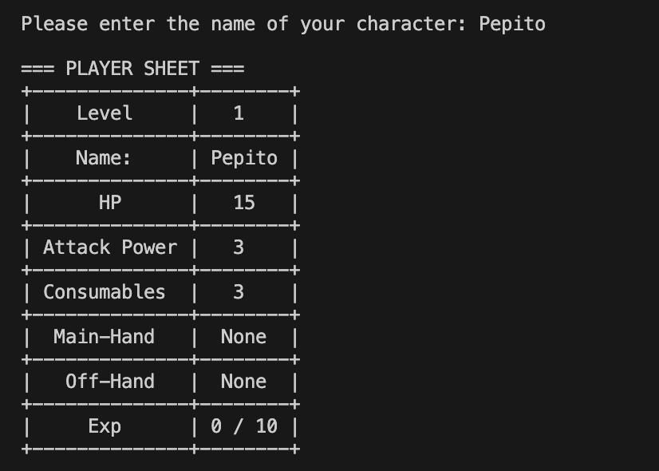
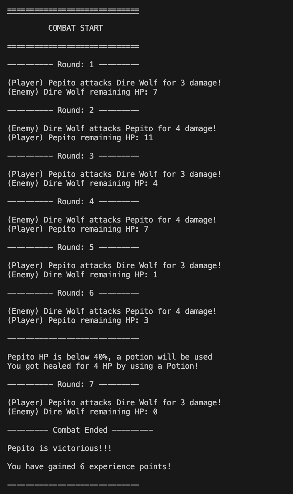

# Simple RPG Game

Simple RPG is a python turn-based combat game. 
It features random enemy encounters, loot drops, equipment, level progression and save/load system.

## Features

### Turn-based combat system
- Dice roll initiative system
- Turns between player and enemy
- Automatic healing potion usage when HP is low
- Round by round combat feed

### Randomized Enemies
- Pool of Common Enemies, Elite Enemies and a Boss
- Each enemy has: 
    - Randomized HP and Attack power
    - Potion drop chance
    - Drop Table
    - XP reward

### Loot & Equipment Drops
- Enemies may drop main-hand and off-hand items
- Player with weapons have the option to swap
- Includes:
    - Weapon Book (see stats of all weapons)
    - Shield Book (see stats of all shields)

### Experience & Leveling System
- Earn XP by defeating enemies
- Automatic level up when reaching the threshold
- On level up:
    - Attack power increases
    - Max HP increases
    - HP fully restores

### Save & Load System
- Option to save progress after a fight
- Stores:
    - Player stats
    - Inventory
    - Equipped gear
    - Combat progress
- Load the game and continue where you left

## Technologies Used

- **Python 3.10+**
- **JSON** for save/load system
- **Tabulate** for table formatting
- **Random** Enemy generation, damage rolls 
- **Time module** delays, UI pace

## Demo

### Character Creation



### Combat example



### Save Game Examples 


## Installation & Setup

1. **Clone the repository**

```bash
git clone https://github.com/NikosKl/Simple-RPG-game.git
cd Simple-RPG-game
```

2. **Create and activate a virtual environment**

```bash
python -m venv venv
source venv/bin/activate # on macOS/Linux
venv\Scripts\activate # on Windows
```

3. **Install Dependencies**
```bash
pip install -r requirements.txt
```

4. **Run the game**
```bash
python main.py
```

## Project Structure

```bash
./
├── LICENSE                     # License
├── README.md                   # Project documentation
├── assets/                     # Screenshots used in README
│   ├── character_creation.png
│   ├── combat.png
│   ├── save_game1.png
│   └── save_game2.png
├── game/                       # Core game package
│   ├── __init__.py
│   ├── combat.py               # Combat loop, drops, main menu
│   ├── enemy.py                # Enemy class
│   ├── enemy_data.py           # Enemy generation and stats
│   ├── equipments.py           # Weapon & shield equip logic
│   ├── helpers.py              # Validation, damage, utilities
│   ├── item_info.py            # Weapon/Shield info tables
│   ├── player.py               # Player & Character classes
│   ├── serialization.py        # Save/load system
│   ├── ui.py                   # UI printing
│   └── weapons.py              # Weapon & Shield classes
├── main.py                     # Starting game
├── requirements.txt            # Dependencies
└── save_game.json              # Sample save file 
```

## How to play

1. Start the game
```bash
python main.py
```
2. Main Menu Options\
1 -- New Game\
Create a new character\
2 -- Load Game\
Continue from your last game\
3 -- Exit Game\
Close the game

3. Character Creation
- Enter a valid name for your character
- Your HP and Attack Power are randomly generated
- A character sheet will be displayed

4. Combat system
- Each fight starts with a **dice roll** to decide who attacks first.
- During combat:
    - You and the enemies take turns attacking
    - Critical hits, weapon damage rolls and shield blocks may occur with weapon equipped
    - If your HP falls below 40% and there is a potion, you'll automatically use it
    - After each fight, you get to decide if you want to use a potion manually

5. Loot & Equipment
- Enemies may drop on defeat:
    - Potions
    - Main-Hand Weapons
    - Off-hand Weapons
- If you don't have a weapon equipped it will automatically get equipped, else you can choose to skip

6. Leveling System
- Defeating enemies grants EXP
- When you level up, your stats are getting increased

7. Saving your progress\
At the end of each fight you get to choose if you want to continue, or save and exit

8. Clearing the game\
Defeating all enemies and the final boss is clearing the game!

## Future Improvements / Roadmap

- Add more enemy varieties and special encounters
- Expand the item system (armor, rare weapons etc)
- Enhance the combat system with additional mechanics
- Introduce player classes and skill progression
- Improve save/load feature